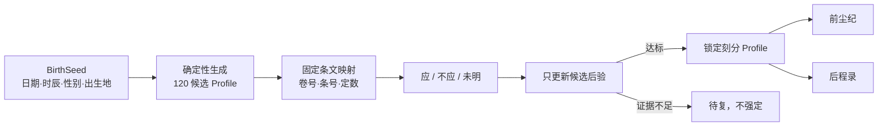

# V4 现代铁板神数因果架构与验收

## 一、核心判断

若“铁板神数”被定义为某一套无法考证的历史秘传公式，本工程不能证明自己等同于该公式；若按用户可感知的方法结构判断，V4 已具备铁板神数的核心形态：先由出生资料起数，生成有限刻分命籍；再以六亲与旧事考刻；每次应验只改变刻分权重；刻位确定后按固定编号启命书。

V3 的根本问题是画像在回答之后形成，数学本质仍像自适应问卷。V4 的根本改进是将“人生假设”前置到回答之前。

## 二、不可逆因果链

禁止的逆向路径包括：回答创建事实、问句直接写入命书、LLM 根据答题原文自由补全、未锁定就生成命书、低置信时强行选择第一名。

## 三、码本与推断

### 1. BirthSeed

BirthSeed 对出生日期、十二时辰、性别和规范化出生地做稳定指纹。任何字段改变都会改变候选先验、事实概率和条文映射。相同输入与内容版本产生相同 replayKey。

### 2. 候选命籍

每个时辰覆盖 120 个分钟候选。每个候选在第一问出现前已经拥有：

- 唯一候选 ID、分钟偏移和先验；
- 540 个事实的固定概率向量；
- 30 个互斥状态轴的唯一选择；
- 预生成核心事实集合；
- 24 条命局与 24 条运限条；
- 命籍签名和可重放编号。

### 3. 选条与更新

系统从未问过、年龄适用的考刻条中计算期望信息增益，兼顾领域覆盖与含混惩罚。回答“应 / 不应”只把固定候选似然乘入对数权重；“未明”不提供正反证据。

停止条件同时检查第一候选概率、四分钟桶概率、第一与第二候选差值、清晰回答数和正向领域数。最多 24 轮；证据不足进入“待复”。

## 四、命书隔离

命书编译器从锁定 Profile 读取预生成事实和运限条，不读取 transcript，也不读取问句文本。相同 Profile 即使命题回答记录不同，命书仍逐字段相同。

前尘编纂另有四道内容闸门：

1. 同义与互斥事实只保留一项；
2. 八个领域优先各取一项，单领域最多两项；
3. 排除明显不合年龄语境的事件窗口；
4. 严重事件最多两项，整体逆境事件最多四项。

每个节点以“命籍条文 + 白话解读”双层呈现。条文来自命局库，不复制考刻问句；解读给出人物、年龄窗口和具体事件。

后程从锁定 Profile 的运限条中选取四个不同领域，给出明确三年窗口、变化和结果，不使用四条同义的保守套话。

## 五、权限与模拟

封存实验把隐藏人生真值放在 Oracle 边界内。回答代理只能得到当前条文和允许的 Persona 行为参数，不能读取完整真值；推断模块只能得到回答，不能读取 Oracle；命书函数只接受锁定 Profile 与 BirthSeed。

正式实验执行 50,000 次程序会话，覆盖模型内、带噪、模型外独立人生、极端冲突、确定性重放和 BirthSeed 反事实。1,500 个 Persona 分为直答、谨慎、冲突三型。

结果为 30/30 预设门槛、8/8 隔离测试通过；默认分钟命中 99.975%，带噪分钟命中 91.34%，模型外画像 Precision / Recall 为 83.68% / 83.61%，相同输入重放 100%。

## 六、验收边界

这些结果说明：在项目定义的事实本体与合成回答模型内，系统能够稳定区分候选、从错答恢复、保持权限隔离并确定性成书。

这些结果不说明：出生分钟科学决定人生、V4 等同某一失传古法、未来预言经过现实验证、合成准确率等于真人准确率。V4 是用现代数学复刻传统流程感知的产品工程，不是历史学或自然科学证明。
