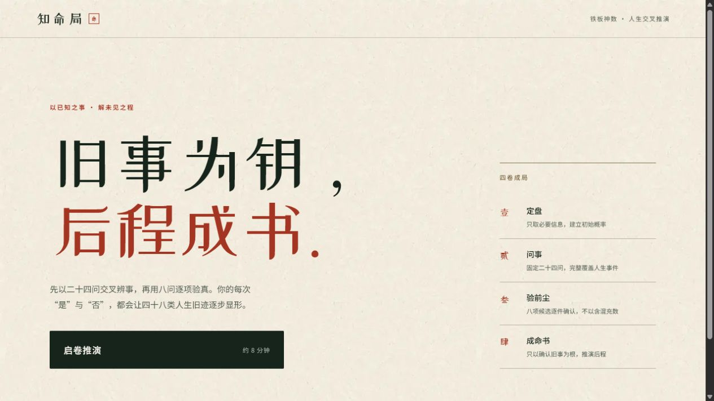
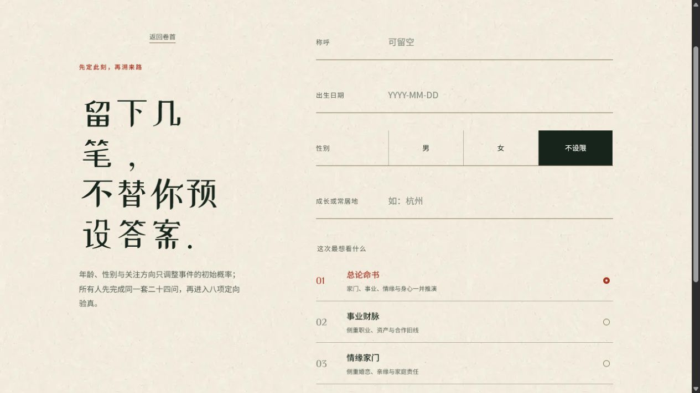
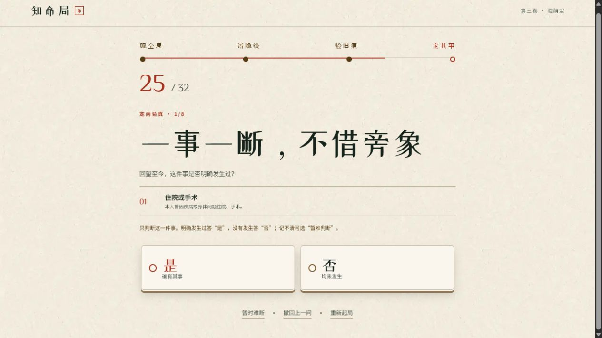
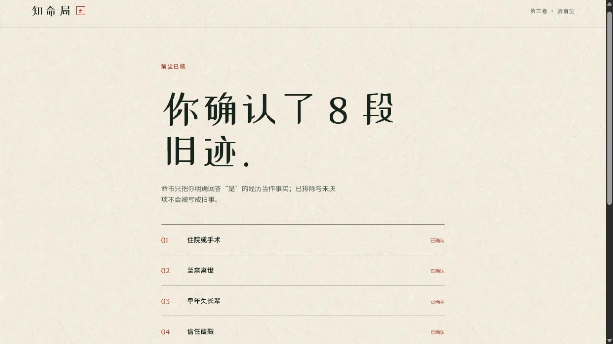
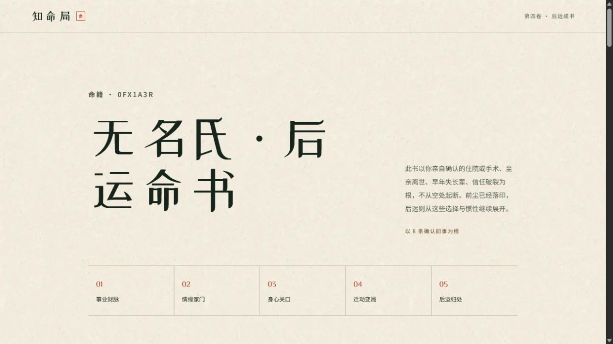
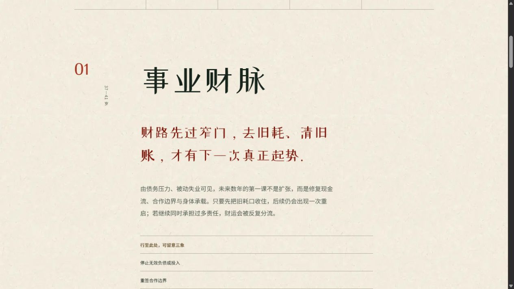

# 铁板神数产品重构调研与 UI 框架

日期：2026-07-21

## 一、结论先行

当前产品的主要问题不是视觉不够精致，而是把后台推断过程直接解释给了用户。首页、定盘页、问事页和命书页反复出现“概率、二十四问、八项验证、依据”等工程语言，使产品像一份演示说明，而不是一次沉浸式的“考时定刻”。

产品应重新定义为：**AI 驱动的交互式铁板命书产品**。用户体验到的是“由出生时辰进入、经条文校刻、落定一刻、展开前尘与后运”；系统内部才运行事件识别、概率更新、问题选择和叙事生成。

## 二、铁板神数流程调研

公开资料并不构成统一、可考证的正统传承，不同资料对算法和刻分的解释存在冲突，产品不应宣称复原某个唯一古法。但它们对外在流程的描述高度一致：

1. 先取得出生年月日时。
2. 以父母、兄弟、婚姻等六亲条文进行核对，称为“考时定刻”或“考刻”。
3. 在若干刻位或条文分支之间反复匹配。
4. 定刻后继续推演不同岁数、六亲与流年条文。
5. 最终把编号和断语排列成命书。

资料依据：

- [鐵版神數：批命操作过程、诗词口诀与起卦诀](https://zh.wikipedia.org/wiki/%E9%90%B5%E7%89%88%E7%A5%9E%E6%95%B8)
- [铁板神数考六亲之真伪：考时定刻、六亲核对与续推](https://www.shusquare.com/forum/discussion/topic-74931/)
- [条文示例：编号、断语、六亲条文与综合条文](https://64gua.com/index.php?c=son&id=21690&s=book)
- [铁板神数的考刻：八刻、条文与配卦的民间资料](https://fengshui-168.net/forum.php?mod=viewthread&page=1&tid=76401)

值得直接转化为产品语言的传统特征：

- 条文是“编号 + 断语”，不是解释报告。
- 考刻用已知事实校准，续推才负责展开未知人生。
- 六亲和岁数是常见骨架。
- 文本常以四字、七言或口诀开头，随后给出明确断语。
- “二十四条”“八刻”可以成为界面叙事，但不能机械翻译成 24 题后再问 8 个明显事件。

## 三、相关心理机制

用户所描述的“听到预言后主动往自己身上套”，主要是 **巴纳姆效应 / 福勒效应（Barnum–Forer effect）**，也称个人验证谬误：人会把模糊、普遍的描述视为对自己的特别描述。[APA Dictionary](https://dictionary.apa.org/barnum-effect)

相关但不同的机制还有：

- **主观验证**：一句话只要唤起个人意义，就容易被当作正确。
- **确认偏误**：更容易寻找、记住与既有判断相符的证据。
- **自我实现预言**：预言改变行为，行为又推动预言实现；这不是“觉得预言很准”的同义词。[APA Dictionary](https://dictionary.apa.org/self-fulfilling-prophecy)

研究还表明，完成一套看似严谨的测试后，人们对同样的概括性反馈会给出更高的个人适配评价。因此“考时定刻”的仪式和收敛过程会影响结果可信度，但它只能作为体验增强层，不能替代前半生事件识别。[Jackson, 1978](https://onlinelibrary.wiley.com/doi/abs/10.1002/1097-4679%28197801%2934%3A1%3C63%3A%3AAID-JCLP2270340113%3E3.0.CO%3B2-X)

## 四、重新定义产品边界

### 产品是什么

它是一次由 AI 驱动的东方人生叙事体验：先通过“考时定刻”识别用户已发生的重要人生节点，再把这些节点编成前尘命书，并以其形成的惯性和矛盾为根，给出时间明确、主题明确的后运命书。

### 产品不是什么

- 不是介绍二进制或概率推断原理的 Demo。
- 不是展示模型如何推理的 AI 报告。
- 不是 32 道固定问卷。
- 不是把用户确认过的标签重新抄一遍。
- 不是用许多“可能、也许、或许”拼成的泛化建议。

### 核心体验契约

用户只需要理解三件事：正在校准出生刻位；每次只需判断条文是否相合；定刻之后会得到一部属于自己的命书。其余解释从主流程删除。

## 五、推荐的新流程

1. **启局**：只收出生日期、出生时辰、性别和地点。地点用于真太阳时或地域化叙事；称呼可选。
2. **考时定刻**：以现代汉语诗体呈现三象合一的条文，用户只答“是 / 否 / 难辨”。
3. **刻位收敛**：系统内部在八个刻位与人生事件画像之间更新后验概率；界面只显示刻针逐渐收拢。
4. **复刻**：只有多个刻位接近时，追加 1–3 条高区分度条文。不要固定追加八问。
5. **落刻**：用印章、刻针与命籍编号呈现“某时某刻已定”，不展示算法解释或确认清单。
6. **前尘成书**：按年龄或年份排列 5–8 个高置信人生节点。
7. **后运成书**：按应期输出主断、触发条件、结果与避忌，形成可收藏的命书。

教育测评中的自适应测试也采用“根据已回答项目更新估计，再选择下一道最有信息的问题”，相较固定长问卷可以用更少项目得到有效区分；该逻辑适合移植到考刻引擎。[ETS 自适应测试技术手册，第 26 页](https://www.de.ets.org/pdfs/toeic/toeic-link-assessments-technical-manual.pdf)

建议的首版参数不是最终真值，而是待模拟验证的起始配置：

- 每屏 1 条条文，内部对应 3 个事件元素。
- 主考刻 16–22 屏，自适应停止，不显示固定总题数。
- 每个潜在事件在不同组合中出现 3–4 次。
- 每对事件的共同出现次数尽量平衡，避免某些组合过度绑定。
- 达到刻位后验阈值后停止；仅在并列时追加 1–3 条复刻。

这既保留“交叉编码”，也避免四个以上元素导致理解负担和“是”率过高。问卷设计领域普遍建议一次只处理一个问题，并谨慎使用展示全部步骤的进度条；这与本产品的单条文沉浸式推进相容。[NHS Question pages](https://service-manual.nhs.uk/design-system/patterns/question-pages)

## 六、条文写作系统

### 写作原则

- 使用“现代汉语诗体”，不是整段文言文。
- 一条三行或三分句，每一行承载一个隐藏事件元素。
- 去掉事件标题、白话解释和三张分卡；条文本身就是问题。
- 用中国文化意象承载含义，但不能只作装饰。
- 结尾统一为“此条若合，点是；若皆不合，点否”。
- 同一事件必须拥有多种意象表达，避免用户察觉重复测试。

### 示例

隐藏元素：远迁 / 长期承担家庭经济责任 / 重大关系破裂。

> 旧城的灯，曾在身后远去；  
> 你也替一家人，扛过一段长久的风雨；  
> 有一份信任，后来没有回到原样。  
> 此三象中，可有一象落在你身上？

这段话仍是白话，用户能理解；同时三种事件已被融合为一条“迁、担、断”的条文，不再由诗句作标题、下方列表泄露真实问题。

### 内部审核

每条文保存隐藏结构：`event_ids`、事件定义、适用年龄、基础发生率、负向/正向强度、互斥关系、刻位权重。审核代理可查看隐藏结构，逐项检查：三元素覆盖、额外含义、阅读难度、含混范围、与题库重复度。面向用户的回答代理只获得渲染后的条文与“是 / 否 / 难辨”接口。

## 七、问题页 UI 结论

### 推荐方向：刻盘校时

- 浅色宣纸底不变，但减少所有解释性小字。
- 顶部不显示“第 7 问 / 共 32 问”，改为一条八刻刻尺或半圆刻盘。
- 标题显示“考时定刻 · 辰时”，刻针随回答逐步收拢。
- 中央只放一条三行断语，行距宽、留白大。
- 页面底部固定两个 3D 实体按键：“是”为朱砂色，“否”为墨色或温灰色；二者尺寸相等。
- “难辨”作为小型文字按钮放在两键之间或下方。
- 回答后只出现 300–500ms 的刻针移动、墨迹收束和轻微落印反馈。

### 为什么不采用三张图片卡片

图片卡片会把“三个隐藏元素”重新拆开，暴露问卷结构；同时用户会判断图片像不像自己，而不是判断条文是否应验。它也容易把产品做成性格测试或塔罗抽卡。图片可以存在，但只适合作为整屏、低对比度的气氛层，并同时融合三种意象，不作为三个可识别、可点击的事件选项。

## 八、命书重构

### 前半生命书

当前“你确认了 8 段旧迹 + 标签列表”只是答卷回放。新版应使用纵向年表或横向命轴，每个节点包含：

- 年龄 / 年份区间。
- 一句强断语。
- 一个具体事件与其后果。
- 与前后节点的因果连接。
- “应”字落印，不展示“模型依据”。

示例：

> **二十二至二十四岁 · 去路忽改**  
> 原本已经成形的一条学业或职业道路，在现实压力下中断。此后你不再完全依赖单一路径，而开始把稳定与自主同时握在手里。

低置信候选不应作为“候选画像”展示给用户；它们只负责决定下一条问题。真正进入命书的必须是达到阈值的节点。

### 后半生命书

每章必须有明确结构：

1. **应期**：明确到 2–4 年窗口。
2. **主断**：只选择一个主要事件方向。
3. **触发**：什么人或什么局势把它引发。
4. **结果**：会带来怎样的职业、财务、关系或居住变化。
5. **忌 / 宜**：一句有行动含义的断语。

示例：

> **三十七至三十九岁 · 职位先动，财路后开**  
> 一次来自上级或合作结构的变化，会使你离开原来的位置；九个月内，新项目或跨地域合作接上。钱不会立刻暴增，但现金流会先稳定。此时最忌替关系人担保，最宜把权责写进纸面。

要避免“一段话同时给出迁居、转行、创业、家庭变化四种可能”。一章只能有一条主线，最多保留一个条件分支。

## 九、现有流程审阅

### 1. 首页：结构不健康

视觉基础成熟，但首页直接解释二十四问、八项验真、概率和四卷流程，仪式感被说明书取代。

### 2. 定盘：部分健康

版式有东方书页气质，但仍解释“初始概率”和固定题数；关注方向选择也让用户更早意识到系统会按主题生成内容。

### 3. 三事件问题：结构不健康

诗句只作标题，真正的问题由三个白话事件列表承担，推断意图完全外露。

### 4. 八项验真：结构不健康

第 25–32 问逐项询问单一重大事件，是整个流程最像套问的位置。

### 5. 前尘确认：结构不健康

标签列表没有岁数、因果和场景，缺少命书应有的“被看见”与震撼感。

### 6. 命书卷首：视觉健康，叙事不足

卷首留白和五章导航成熟，但“以 8 条确认旧事为根”继续暴露机制。

### 7. 命书章节：部分健康

排版已接近正式文化产品，但文案同时列出多种可能、缺少明确节点和可验证的后果，导致用户感觉言之无物。

## 十、下一轮实施边界

下一轮不应在现有 32 题上继续润色。应先完成以下三项，再动代码：

1. 重建“刻位—事件—条文”数据模型和自适应停止规则。
2. 生成并审核第一批三象合一条文，至少覆盖一个完整模拟题库。
3. 做三套问题页视觉方案，只改变“考时定刻”的呈现方向，不同时改算法和命书，以便选定视觉靶点。

